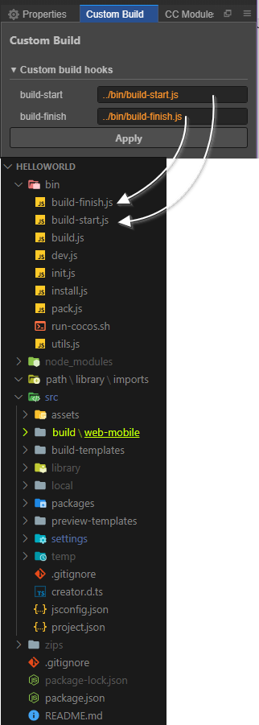

# A Cocos Creator Custom Build Panel
## Installation
```bash
cd ~/.CocosCreator/packages # Mac
cd c:\Users\<username>\.CocosCreator\packages\ # Windows
git clone https://github.com/aztack/cc-custom-build.git
```

## Screenshot


## Custom build scripts

[Cocos Docs: Custom project build template](https://docs.cocos.com/creator/manual/zh/publish/custom-project-build-template.html)

`build-start.js`:

```js
module.exports = function(options /* see above cocos docs*/) {
  Editor.log(`Build start with options:`)
  Editor.warn(options);
}
```

`build-finish.js`:
```js
module.exports = function(options) {
  const ejs = require('ejs');
  const fs = require('fs');
  const path = require('path');
  const htmlPath = path.resolve(options.project, 'build/web-mobile/index.html')
  const tpl = fs.readFileSync(htmlPath).toString()
  const result = ejs.render(tpl, {
    project: options.title,
    orientation: options.webOrientation,
    webDebugger: ''
  });
  fs.writeFileSync(path.resolve(options.dest, 'index.html'), result);
  Editor.log(`Post-process index.html finished!`);
}
```